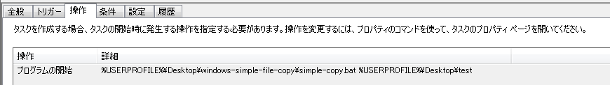

# Simple file backup script(Windows)

Create backup directory which you indicate, although it can use only Windows.  
Backup directory created on `%USERPROFIE%\backup` folder. 

## Usage

After clone or download this repository, you can use this with below command.  

```bat
cd windows-simple-file-copy

rem First argument is backup target directory/file  
simple-copy.bat %USERPROFILE%\hoge
```

After this script, you can confirm backup folder on `%USERPROFILE%\backup`.  
If you want to do backup continuously, I recommend you to set Task Scheduler like below.  



In addition, you can see log on `%USERPROFILE%\backup\log.txt`

## Note

Originally, this tool create for myself.
Therefore there are some bugs.  
If you find it, please tell me about it.

## Licence 

* MIT
